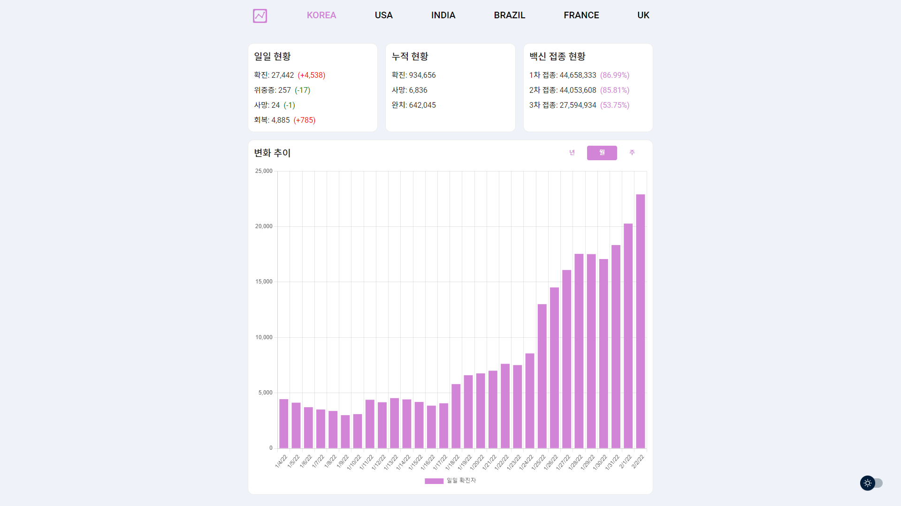
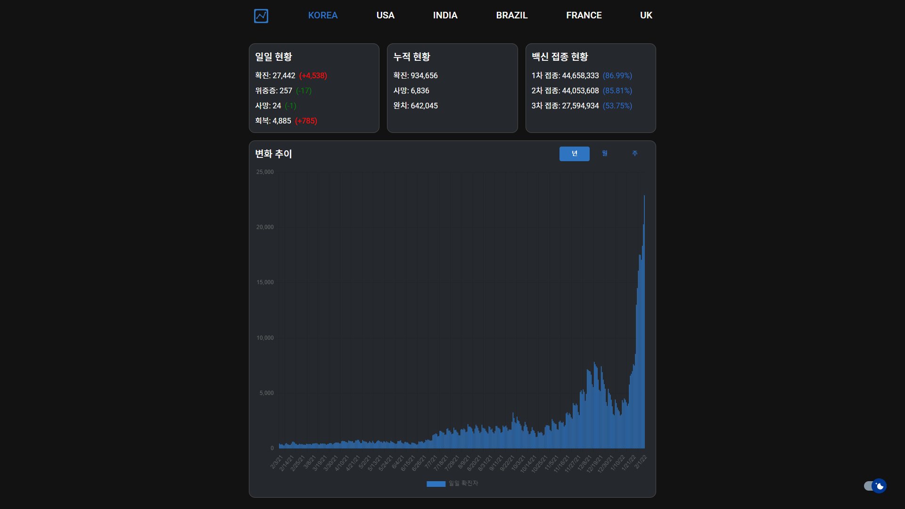

# covid-announcer

코로나 현황을 알려주는 나만의 아나운서

## 주요 기능

- 대한민국 및 코로나 확진자 수가 가장 많이 발생하는 5개 국가의 코로나 발생 현황을 수치 데이터 및 차트로 제공합니다.
- 사용자 기호에 따라 dark/light 모드를 선택할 수 있습니다. 기본 설정은 사용자 OS 테마를 따릅니다.

## 예정 기능

인구 대비 확진자 비율을 세계 지도에 색상으로 표현해, 한 눈에 파악할 수 있도록합니다.

## 사용 화면

